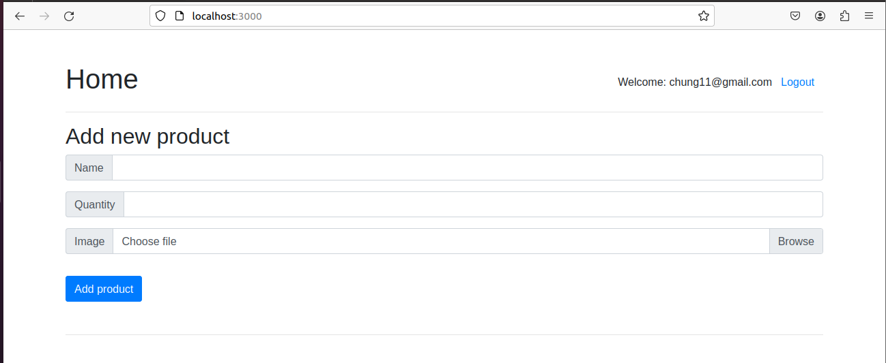

## Project này có các chức năng:

Trang đăng nhập, đăng kí
Bên trong có thêm mới sản phẩm, liệt kê danh sách sản phẩm ứng với user đăng nhập.

## Project này có kiến trúc :

Có 2 model là User và Product
Dùng MongoDB để lưu trữ dữ liệu
Dùng Redis để lưu trữ session của user đăng nhập
Để xử lý Login/Logout ta dùng PassportJS
Để xử lý upload file ta dùng Multer

Sử dụng Docker để deploy sản phẩm.

HÌnh ảnh demo:

